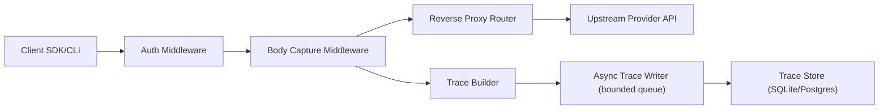

# OngoingAI Gateway

[](LICENSE)
[](https://go.dev)
[](https://github.com/ongoingai/gateway/releases)

**Open-source AI gateway for tracing, cost visibility, and audit-ready logs — with minimal overhead.**

OngoingAI Gateway runs in front of your AI providers so every request is **visible, attributable, and reproducible** — without changing your code. Works with OpenAI, Anthropic, and OpenAI-compatible APIs.

### Why it exists

AI calls are production traffic, but most teams can't answer the questions that matter:

- Which models are being used — and by what service, key, or workspace?
- What did it cost per route, per team, or per environment?
- What changed when latency spiked, errors started, or spend jumped?
- Can we reproduce a request for debugging or audit?

OngoingAI Gateway gives you a **provider-agnostic request log** with **privacy-first defaults**: tokens, latency, cost, and key hashes are always captured; request/response bodies are opt-in.

---

## Quickstart

### 1) Install and start the gateway

```bash
curl -fsSL https://ongoing.ai/install.sh | sh
ongoingai serve
```

### 2) Point SDKs and CLI tools at the gateway

```bash
eval "$(ongoingai shell-init)"
```

Or set manually:

```bash
export OPENAI_BASE_URL=http://localhost:8080/openai/v1
export ANTHROPIC_BASE_URL=http://localhost:8080/anthropic
```

### 3) Send requests through both providers

```bash
curl http://localhost:8080/openai/v1/chat/completions \
  -H "Authorization: Bearer $OPENAI_API_KEY" \
  -H "Content-Type: application/json" \
  -d '{"model":"gpt-4o-mini","messages":[{"role":"user","content":"Reply with ok"}]}'

curl http://localhost:8080/anthropic/v1/messages \
  -H "x-api-key: $ANTHROPIC_API_KEY" \
  -H "anthropic-version: 2023-06-01" \
  -H "content-type: application/json" \
  -d '{"model":"claude-sonnet-4-latest","max_tokens":128,"messages":[{"role":"user","content":"Reply with ok"}]}'
```

### 4) Stop the gateway and print an offline report

```bash
# Stop ongoingai serve (Ctrl+C), then run:
ongoingai report
ongoingai debug last
```

`ongoingai report` and `ongoingai debug last` read configured storage directly, so they work even when the server is not running.

### Alternative start modes

**Docker:**

```bash
docker run --rm -p 8080:8080 \
  -v "$(pwd)/data:/app/data" \
  ghcr.io/ongoingai/gateway:latest
```

**Build from source:**

```bash
git clone https://github.com/ongoingai/gateway.git
cd gateway && make build
./bin/ongoingai serve
```

---

## Features

**Provider Agnostic** — Works with OpenAI, Anthropic, and any OpenAI-compatible API. No vendor lock-in.

**Zero-Config Start** — Single binary, embedded SQLite, no external dependencies. Running in under 30 seconds.

**Full Trace Capture** — Every request logged with model, tokens, latency, cost, and API key hash. Streaming is proxied in real time with minimal overhead.

**HTTP Analytics API** — Query traces plus usage, cost, model, key, latency, and error-rate analytics via stable JSON endpoints.

**Reproducible Calls** — Trace metadata always captures model, tokens, latency, cost, and route context. Enable body capture for full payload-level replay.

**Privacy First** — Request/response body logging is off by default and opt-in. API keys are hashed, never stored in plain text.

**PII Redaction** — Configurable redaction modes for storage and upstream traffic, with scoped policies per workspace or provider.

**Broad Compatibility** — Most tools that support OpenAI/Anthropic base URL configuration work via environment variables, with no plugins required.

---

## How Auth Works

**Default mode:** your tools still hold the provider keys. OngoingAI Gateway forwards `OPENAI_API_KEY` / `ANTHROPIC_API_KEY` and stores only hashed key identifiers in traces.

**Team gateway keys (optional):** Enable `auth.enabled` to require gateway authentication on proxy and analytics routes. Gateway tokens are passed via `X-OngoingAI-Gateway-Key` and are used only for gateway authorization (RBAC + tenant identity). Provider API keys are still supplied by the client and are never stored by OngoingAI.

See `AUTHORIZATION.md` for the resource/action/scope policy and role-permission matrix.

---

## Request Flow



- Gateway auth is enforced before any provider forwarding.
- Provider credentials are passed through upstream; gateway auth headers are stripped.
- Trace writes are asynchronous so proxy response latency is not gated on storage.

---

## Security & Privacy

- **API keys:** Forwarded to the upstream provider, never stored. Only hashed identifiers are kept in traces.
- **Request/response bodies:** Off by default. Opt in with `capture_bodies: true` and cap size via `body_max_size`.
- **Metadata:** Always captured (model, tokens, latency, cost) regardless of body capture settings.
- **Storage:** SQLite file stored locally. Ensure appropriate file permissions on `data/ongoingai.db`.
- **Gateway auth:** Optional team/role-based key auth is available via config and should be enabled for shared/team deployments.

---

## Usage

### With AI CLI Tools

```bash
# Shell initialization (add to .bashrc / .zshrc)
eval "$(ongoingai shell-init)"

# Now use any tool normally
claude-code "refactor the auth module"
codex "write integration tests"
aider --model gpt-4o
```

### Wrap Command

Run any command through the gateway without changing your environment:

```bash
ongoingai wrap -- claude-code "fix the bug in main.go"
ongoingai wrap -- python my_ai_script.py
```

### With SDKs

```python
# OpenAI
from openai import OpenAI
client = OpenAI(base_url="http://localhost:8080/openai/v1")
response = client.chat.completions.create(
    model="gpt-4o",
    messages=[{"role": "user", "content": "Hello"}]
)

# Anthropic
import anthropic
client = anthropic.Anthropic(base_url="http://localhost:8080/anthropic")
message = client.messages.create(
    model="claude-sonnet-4-latest",
    max_tokens=1024,
    messages=[{"role": "user", "content": "Hello"}]
)
```

---

## Compatibility

Works automatically with any tool that supports custom base URLs:

| Tool | Env Var / Setting | Value |
|------|-------------------|-------|
| Claude Code | `ANTHROPIC_BASE_URL` | `http://localhost:8080/anthropic` |
| OpenAI Codex CLI | `OPENAI_BASE_URL` | `http://localhost:8080/openai/v1` |
| Aider | `OPENAI_API_BASE` or `--openai-api-base` | `http://localhost:8080/openai/v1` |
| Continue (VS Code) | `apiBase` in config | `http://localhost:8080/openai/v1` |
| LangChain | `base_url` on LLM client | `http://localhost:8080/openai/v1` |
| Custom apps | Set base URL on any OpenAI/Anthropic SDK | See above |

**Note:** OpenAI-compatible tools generally expect `/v1` in the base URL. Anthropic SDKs do not.

---

## Configuration

OngoingAI Gateway works with zero configuration. For customization, create `ongoingai.yaml`:

```yaml
server:
  port: 8080
  host: 0.0.0.0

storage:
  driver: sqlite                # sqlite (default) | postgres
  path: ./data/ongoingai.db     # SQLite path
  # dsn: postgres://...         # Postgres connection string

providers:
  openai:
    upstream: https://api.openai.com
    prefix: /openai
  anthropic:
    upstream: https://api.anthropic.com
    prefix: /anthropic

tracing:
  capture_bodies: false         # Off by default
  body_max_size: 1048576        # 1MB default

auth:
  enabled: false
  header: X-OngoingAI-Gateway-Key
```

Schema migrations for SQLite and Postgres are embedded in the binary and applied automatically at startup.

For the full configuration reference (PII redaction, OpenTelemetry, gateway keys, env overrides), see the [Configuration Reference](https://docs.ongoing.ai/gateway/reference/config-reference).

---

## API

Query traces and analytics programmatically. Full schema: [`openapi/openapi.yaml`](openapi/openapi.yaml)

```bash
GET /api/traces?limit=50&provider=anthropic   # List traces
GET /api/traces/:id                           # Trace detail
GET /api/analytics/usage?group_by=model       # Usage analytics
GET /api/analytics/cost?group_by=provider     # Cost analytics
GET /api/analytics/models                     # Model comparison
GET /api/analytics/keys                       # Key analytics
GET /api/analytics/latency?group_by=provider  # Latency distributions
GET /api/analytics/errors?group_by=route      # Error-rate breakdowns
GET /api/analytics/summary                    # Combined summary
GET /api/health                               # Health check
```

---

## Supported Providers

| Provider | Streaming | Token Counting | Cost Estimation |
|----------|-----------|----------------|-----------------|
| OpenAI | Supported | Supported | Supported |
| Anthropic | Supported | Supported | Supported |
| OpenAI-Compatible | Supported | Supported | Manual config |

Coming soon: Google Gemini, Mistral, Cohere, local models (Ollama).

## Storage Backends

| Backend | Use Case | Status |
|---------|----------|--------|
| SQLite | Default. Zero setup, single file, embedded. | Supported |
| PostgreSQL | Teams, higher throughput, existing infra. | Supported |
| ClickHouse | Large-scale analytics, long retention. | Planned |

---

## Automated Releases

Release workflow details are documented in `release-automation.md`, including CI/build/test behavior, auto-tagging strategy, GitHub release + Docker publishing, and install-script hosting setup.

---

## Roadmap

See [ROADMAP.md](ROADMAP.md) for phase-based forward planning.
See [RELEASE_NOTES.md](RELEASE_NOTES.md) for completed milestones.

**Now:** Core proxy, trace capture, SQLite + Postgres storage, OpenAI + Anthropic support, gateway authz.

**Next:** Additional providers, policy controls, and operational hardening.

**Later:** ClickHouse analytics, alerting, prompt replay, SDK instrumentation, enterprise features.

---

## Contributing

Contributions are welcome. See [CONTRIBUTING.md](CONTRIBUTING.md) for guidelines.

The project is structured to make adding new providers straightforward — implement the `Provider` interface and register it. See `internal/providers/` for examples.

---

## Security

Security policy and reporting guidance are in [SECURITY.md](SECURITY.md).

Community expectations are defined in [CODE_OF_CONDUCT.md](CODE_OF_CONDUCT.md).

---

## License

OngoingAI Gateway is licensed under the [Apache License 2.0](LICENSE).

---

## Links

- **Docs:** https://docs.ongoing.ai/gateway
- **Website:** https://ongoing.ai
- **GitHub:** https://github.com/ongoingai/gateway
- **X:** https://x.com/ongoingai
