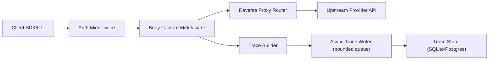

# OngoingAI Gateway

**Open-source AI gateway for tracing, cost visibility, and audit-ready logs — with minimal overhead.**

OngoingAI Gateway runs in front of your AI providers so every request is **visible, attributable, and reproducible** — without changing your code. Works with OpenAI, Anthropic, and OpenAI-compatible APIs.

### Why it exists

AI calls are production traffic, but most teams can’t answer the questions that matter:

- Which models are being used — and by what service, key, or workspace?
- What did it cost per route, per team, or per environment?
- What changed when latency spiked, errors started, or spend jumped?
- Can we reproduce a request for debugging or audit?

OngoingAI Gateway gives you a **provider-agnostic request log** with **privacy-first defaults**: tokens, latency, cost, and key hashes are always captured; request/response bodies are opt-in.

### Get started in under a minute

```bash
curl -sSL https://ongoingai.dev/install.sh | sh
ongoingai serve
eval "$(ongoingai shell-init)"
```

Or set base URLs manually:

```bash
export OPENAI_BASE_URL=http://localhost:8080/openai/v1
export ANTHROPIC_BASE_URL=http://localhost:8080/anthropic
```

Use your tools normally — everything is now traced.

Need a full validation path (sample request + trace verification)? Jump to [Quickstart](#quickstart).

---

## How Auth Works

**Default mode:** your tools still hold the provider keys. OngoingAI Gateway forwards `OPENAI_API_KEY` / `ANTHROPIC_API_KEY` and stores only hashed key identifiers in traces.

**Team gateway keys (optional):** Enable `auth.enabled` to require gateway authentication on proxy and analytics routes. Gateway tokens are passed via `X-OngoingAI-Gateway-Key` and are used only for gateway authorization (RBAC + tenant identity). Provider API keys are still supplied by the client request and are never stored by OngoingAI.

See `AUTHORIZATION.md` for the explicit resource/action/scope policy and role-permission matrix.

---

## Request Flow



- Gateway auth is enforced before any provider forwarding.
- Provider credentials are passed through upstream; gateway auth headers are stripped.
- Trace writes are asynchronous so proxy response latency is not gated on storage.

---

## Features

**Provider Agnostic** — Works with OpenAI, Anthropic, and any OpenAI-compatible API. No vendor lock-in.

**Zero-Config Start** — Single binary, embedded SQLite, no external dependencies. Running in under 30 seconds.

**Full Trace Capture** — Every request and response logged with model, tokens, latency, cost, and API key hash. Streaming is proxied in real time; tracing adds minimal overhead and never blocks the stream.

**HTTP Analytics API** — Query traces, usage, cost, model stats, and key activity via stable JSON endpoints.

**Reproducible Calls** — Trace metadata always captures model, tokens, latency, cost, and route context. Enable body capture for full payload-level replay.

**Privacy First** — Metadata (model, tokens, latency, cost) is always captured. Request/response body logging is off by default and opt-in. API keys are hashed, never stored in plain text.

**Broad Compatibility** — Most tools that support OpenAI/Anthropic base URL configuration work via environment variables, with no plugins required.

---

## Security & Privacy

- **API keys:** Forwarded to the upstream provider, never stored. Only hashed identifiers are kept in traces.
- **Request/response bodies:** Off by default. Opt in with `capture_bodies: true` and cap size via `body_max_size`.
- **Metadata:** Always captured (model, tokens, latency, cost) regardless of body capture settings.
- **Storage:** SQLite file stored locally. Ensure appropriate file permissions on `data/ongoingai.db`.
- **Gateway auth:** Optional team/role-based key auth is available via config and should be enabled for shared/team deployments.

---

## Quickstart

This is the fastest end-to-end path: install, send one request, and confirm trace capture.

### Prerequisites

- One provider key available in your shell (`OPENAI_API_KEY` and/or `ANTHROPIC_API_KEY`)
- Port `8080` open on localhost

### 1) Install and start the gateway

```bash
curl -sSL https://ongoingai.dev/install.sh | sh
ongoingai serve
```

### 2) Point SDKs and CLI tools at the gateway

Use the helper command:

```bash
eval "$(ongoingai shell-init)"
```

Or set manually:

```bash
export OPENAI_BASE_URL=http://localhost:8080/openai/v1
export ANTHROPIC_BASE_URL=http://localhost:8080/anthropic
```

### 3) Send one request through the gateway

```bash
curl http://localhost:8080/openai/v1/chat/completions \
  -H "Authorization: Bearer $OPENAI_API_KEY" \
  -H "Content-Type: application/json" \
  -d '{"model":"gpt-4o-mini","messages":[{"role":"user","content":"Reply with ok"}]}'
```

### 4) Verify trace capture

```bash
curl http://localhost:8080/api/health
curl "http://localhost:8080/api/traces?limit=1"
```

Verify the trace appears in `GET /api/traces?limit=1`.

### Alternative Start Modes

#### Docker

```bash
mkdir -p ./data

docker run --rm -p 8080:8080 \
  -v "$(pwd)/data:/app/data" \
  ghcr.io/ongoingai/gateway:latest
```

#### Build from source

```bash
git clone https://github.com/ongoingai/gateway.git
cd gateway
make build
./bin/ongoingai serve

# Optional: build release binaries for multiple platforms
make build-cross
# outputs:
#   dist/ongoingai_linux_amd64
#   dist/ongoingai_linux_arm64
#   dist/ongoingai_darwin_amd64
#   dist/ongoingai_darwin_arm64
#   dist/ongoingai_windows_amd64.exe
```

---

## Automated Releases

Release workflow details are documented in `release-automation.md`, including:

- CI/build/test behavior
- Auto-tagging strategy via `release/version.conf`
- GitHub release + Docker publishing
- Optional install-script hosting setup

---

## Configuration

OngoingAI Gateway works with zero configuration. For customization, create `ongoingai.yaml`:

```yaml
server:
  port: 8080
  host: 0.0.0.0

storage:
  driver: sqlite                # sqlite (default) | postgres
  path: ./data/ongoingai.db     # SQLite path
  # dsn: postgres://...         # Postgres connection string

providers:
  openai:
    upstream: https://api.openai.com
    prefix: /openai
  anthropic:
    upstream: https://api.anthropic.com
    prefix: /anthropic

tracing:
  capture_bodies: false         # Off by default. Set true to log full request/response bodies.
  body_max_size: 1048576        # Max body size to store (1MB default)

observability:
  otel:
    enabled: false
    endpoint: localhost:4318
    insecure: true
    service_name: ongoingai-gateway
    traces_enabled: true
    metrics_enabled: true
    sampling_ratio: 1.0
    export_timeout_ms: 3000
    metric_export_interval_ms: 10000

pii:
  mode: ""                      # "" (auto), off, redact_storage, redact_upstream, block
  policy_id: default/v1
  scopes:
    - match:
        workspace_id: workspace-compliance
        provider: openai
        route_prefix: /openai/v1/chat
      mode: block
      policy_id: workspace-compliance/v1
  stages:
    request_headers: true
    request_body: true
    response_headers: true
    response_body: true
  replacement:
    format: "[{type}_REDACTED:{hash}]"
    hash_salt: ""

auth:
  enabled: false
  header: X-OngoingAI-Gateway-Key
  keys:
    - id: team-a-dev-1
      token: replace-me
      org_id: org-default
      workspace_id: workspace-default
      role: developer
      permissions:
        - proxy:write
        - analytics:read
```

Or use environment variables:

```bash
ONGOINGAI_PORT=8080
ONGOINGAI_STORAGE_DRIVER=sqlite
ONGOINGAI_CAPTURE_BODIES=false
OTEL_SDK_DISABLED=true
OTEL_EXPORTER_OTLP_ENDPOINT=localhost:4318
OTEL_SERVICE_NAME=ongoingai-gateway
ONGOINGAI_PII_MODE=
ONGOINGAI_PII_POLICY_ID=default/v1
ONGOINGAI_PII_HASH_SALT=
ONGOINGAI_AUTH_ENABLED=false
ONGOINGAI_AUTH_HEADER=X-OngoingAI-Gateway-Key
```

Schema migrations for `sqlite` and `postgres` trace storage are embedded in the binary and applied automatically at startup.

### Config Reference (Most Used Settings)

| YAML key | Default | Purpose |
|----------|---------|---------|
| `server.host` | `0.0.0.0` | Bind host for HTTP server |
| `server.port` | `8080` | Port for proxy + API |
| `storage.driver` | `sqlite` | Storage backend (`sqlite` or `postgres`) |
| `storage.path` | `./data/ongoingai.db` | SQLite database path |
| `storage.dsn` | unset | Postgres DSN when `storage.driver=postgres` |
| `providers.openai.upstream` | `https://api.openai.com` | Upstream OpenAI endpoint |
| `providers.openai.prefix` | `/openai` | Proxy route prefix for OpenAI-compatible calls |
| `providers.anthropic.upstream` | `https://api.anthropic.com` | Upstream Anthropic endpoint |
| `providers.anthropic.prefix` | `/anthropic` | Proxy route prefix for Anthropic calls |
| `tracing.capture_bodies` | `false` | Persist request/response bodies in traces |
| `tracing.body_max_size` | `1048576` | Max captured body bytes per request/response |
| `observability.otel.enabled` | `false` | Enable native OpenTelemetry OTLP HTTP export |
| `observability.otel.endpoint` | `localhost:4318` | OTLP collector endpoint |
| `observability.otel.sampling_ratio` | `1.0` | Parent-based trace sampling ratio |
| `pii.mode` | auto (`off` when body capture disabled, `redact_storage` when enabled) | PII handling mode (`off`, `redact_storage`, `redact_upstream`, `block`) |
| `pii.policy_id` | `default/v1` | Policy identifier emitted in trace metadata |
| `pii.scopes[]` | `[]` | Optional scoped policy overrides by org/workspace/key/provider/route prefix |
| `pii.stages.*` | `true` | Enable/disable request/response redaction stages |
| `pii.replacement.format` | `[{type}_REDACTED:{hash}]` | Placeholder template for redacted values |
| `auth.enabled` | `false` | Require gateway key auth for proxy/API access |
| `auth.header` | `X-OngoingAI-Gateway-Key` | Header used for gateway key auth |

---

## Usage

### With AI CLI Tools

```bash
# Shell initialization (add to .bashrc / .zshrc)
eval "$(ongoingai shell-init)"

# Or set manually
export OPENAI_BASE_URL=http://localhost:8080/openai/v1
export ANTHROPIC_BASE_URL=http://localhost:8080/anthropic

# Optional (team mode): include gateway auth header in addition to provider keys.
# Gateway key is for OngoingAI auth only; provider keys remain your own.
# curl example:
#   -H "X-OngoingAI-Gateway-Key: gwk_..."
#   -H "Authorization: Bearer $OPENAI_API_KEY"

# Now use any tool normally
claude-code "refactor the auth module"
codex "write integration tests"
aider --model gpt-4o
```

### With the OpenAI SDK

```python
from openai import OpenAI

client = OpenAI(base_url="http://localhost:8080/openai/v1")
response = client.chat.completions.create(
    model="gpt-4o",
    messages=[{"role": "user", "content": "Hello"}]
)
```

### With the Anthropic SDK

```python
import anthropic

client = anthropic.Anthropic(base_url="http://localhost:8080/anthropic")
message = client.messages.create(
    model="claude-sonnet-4-latest",
    max_tokens=1024,
    messages=[{"role": "user", "content": "Hello"}]
)
```

### With cURL

```bash
curl http://localhost:8080/openai/v1/chat/completions \
  -H "Authorization: Bearer $OPENAI_API_KEY" \
  -H "Content-Type: application/json" \
  -d '{"model": "gpt-4o", "messages": [{"role": "user", "content": "Hello"}]}'
```

### Wrap Command

Run any command through the gateway without changing your environment:

```bash
ongoingai wrap -- claude-code "fix the bug in main.go"
ongoingai wrap -- python my_ai_script.py
```

---

## Compatibility

Works automatically with any tool that supports custom base URLs:

| Tool | Env Var / Setting | Value |
|------|-------------------|-------|
| Claude Code | `ANTHROPIC_BASE_URL` | `http://localhost:8080/anthropic` |
| OpenAI Codex CLI | `OPENAI_BASE_URL` | `http://localhost:8080/openai/v1` |
| Aider | `OPENAI_API_BASE` or `--openai-api-base` | `http://localhost:8080/openai/v1` |
| Continue (VS Code) | `apiBase` in config | `http://localhost:8080/openai/v1` |
| LangChain | `base_url` on LLM client | `http://localhost:8080/openai/v1` |
| Custom apps | Set base URL on any OpenAI/Anthropic SDK | See above |

**Note:** OpenAI-compatible tools generally expect `/v1` in the base URL. Anthropic SDKs do not.

---

## Headless Scope

This repository currently serves gateway APIs and a root status JSON document.

- `GET /` returns basic service metadata (`name`, `version`, `status`).
- Trace and analytics data are available via `/api/*` routes documented below.
- This project is a headless AI gateway. Web UI features are out of scope.

---

## API

Query traces and analytics programmatically:

OpenAPI schema: `openapi/openapi.yaml`

```bash
# List recent traces
GET /api/traces?limit=50&provider=anthropic

# Get trace detail
GET /api/traces/:id

# Usage analytics
GET /api/analytics/usage?from=2025-01-01&to=2025-01-31&group_by=model

# Cost analytics
GET /api/analytics/cost?group_by=provider&bucket=day

# Model comparison
GET /api/analytics/models

# Key analytics
GET /api/analytics/keys

# Health check
GET /api/health
```

---

## Supported Providers

| Provider | Status | Streaming | Token Counting | Cost Estimation |
|----------|--------|-----------|----------------|-----------------|
| OpenAI | Supported | Supported | Supported | Supported |
| Anthropic | Supported | Supported | Supported | Supported |
| OpenAI-Compatible | Supported | Supported | Supported | Manual config |

Coming soon: Google Gemini, Mistral, Cohere, local models (Ollama).

---

## Storage Backends

| Backend | Use Case | Status |
|---------|----------|--------|
| SQLite | Default. Zero setup, single file, embedded. | Supported |
| PostgreSQL | Teams, higher throughput, existing infra. | Supported |
| ClickHouse | Large-scale analytics, long retention. | Planned |

---

## Design Goals & Non-Goals

**Goals (v1):**
- Minimal overhead — streaming integrity is sacred
- Provider-agnostic metrics with a unified view
- Single binary, zero external dependencies
- Full trace capture with configurable privacy

**Non-goals (v1):**
- Agent graph semantics or conversation-level analysis (planned for Phase 3)
- Prompt management or eval frameworks
- Replacing existing observability stacks (we complement them)

---

## Roadmap

See [ROADMAP.md](ROADMAP.md) for phase-based forward planning.
See [RELEASE_NOTES.md](RELEASE_NOTES.md) for completed milestones and `1.0.0` tracking.

**Now:** Core proxy, trace capture, SQLite + Postgres storage, OpenAI + Anthropic support, gateway authz.

**Next:** Additional providers, policy controls, and operational hardening.

**Later:** ClickHouse analytics, alerting, prompt replay, SDK instrumentation, enterprise features.

---

## Contributing

Contributions are welcome. See [CONTRIBUTING.md](CONTRIBUTING.md) for guidelines.

The project is structured to make adding new providers straightforward — implement the `Provider` interface and register it. See `internal/providers/` for examples.

---

## Security

Security policy and reporting guidance are in [SECURITY.md](SECURITY.md).

Community expectations are defined in [CODE_OF_CONDUCT.md](CODE_OF_CONDUCT.md).

---

## License

OngoingAI Gateway is licensed under the [Apache License 2.0](LICENSE).

---

## Links

- **Website:** https://ongoingai.com
- **GitHub:** https://github.com/ongoingai/gateway
- **X:** https://x.com/ongoingai
